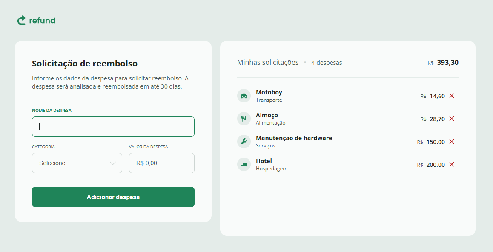

# Refund — Simulador de Solicitação de Reembolso 💸

O **Refund** é um template desenvolvido em **JavaScript puro** com o objetivo de simular uma solicitação de reembolso de despesas.  
O usuário pode registrar uma despesa informando o nome, a categoria e o valor. Cada despesa adicionada é listada na interface e o sistema calcula automaticamente o **total de despesas**.

Este projeto é ideal para quem deseja entender e praticar:
- Manipulação do **DOM**
- **Formatação de valores monetários**
- Captura e tratamento de eventos do usuário
- Atualização dinâmica de elementos em tela

---

## ✨ Funcionalidades

- Adicionar uma nova despesa com:
  - Nome
  - Categoria
  - Valor formatado em Real (R$)
- Exibir as despesas registradas em uma lista organizada
- Remover despesas individualmente
- Calcular automaticamente o **total de solicitações**
- Interface leve e responsiva

---

## 💻 Tecnologias utilizadas

| Tecnologia | Descrição |
|-----------|-----------|
| **HTML5** | Estrutura do layout |
| **CSS3**  | Estilização e responsividade |
| **JavaScript (Vanilla)** | Lógica de funcionamento e manipulação do DOM |

---

## 🔗 Acesse o projeto online
Você pode visualizar o site publicado via GitHub Pages clicando no link abaixo:

👉 [Acessar Projeto Refund](https://llorenzojorge.github.io/projeto-refund/)

---

Desenvolvido por [Lorenzo Jorge](https://github.com/llorenzojorge) 💻